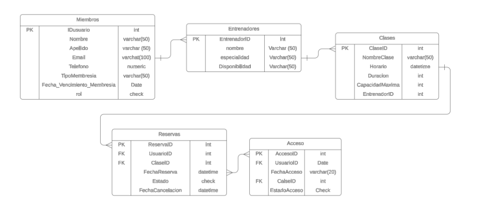
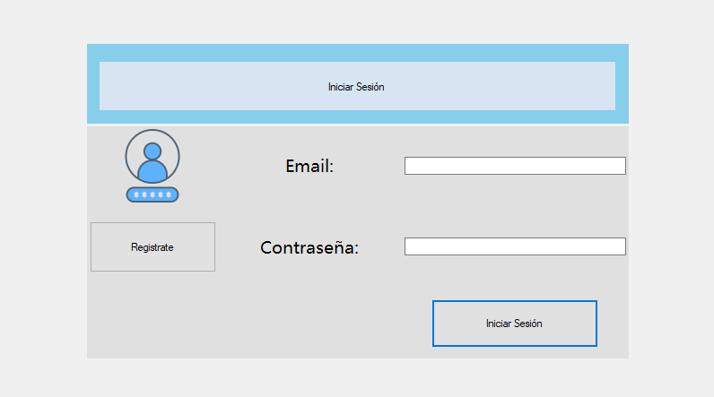
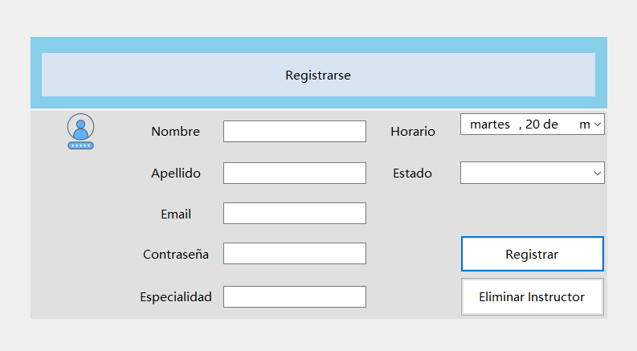
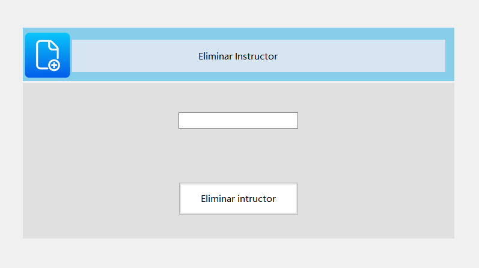

# GimnasioApp

## Propósito del proyecto

Aplicación de escritorio desarrollada en C# con Windows Forms y SQL Server, cuyo objetivo es gestionar usuarios, instructores y clases de un gimnasio. El proyecto permite el registro, autenticación y operaciones CRUD, con control de acceso según el rol del usuario.

---

## Funcionalidades desarrolladas

### Autenticación con control de acceso por roles

Se implementó un formulario de inicio de sesión (`FrmLogin`) con autenticación para dos tipos de usuarios:

- **Miembro**: autenticado desde la tabla `Miembros`.
- **Instructor**: autenticado desde la tabla `Instructores`.

Según el tipo de usuario autenticado, el sistema redirige a un menú específico:

- `FrmMenuMiembro`: menú limitado para miembros.
- `FrmMenuInstructor`: menú exclusivo para instructores, con acceso a registrar y eliminar clases.

### Registro de usuarios

- Formulario `FrmRegistro`: permite registrar miembros con sus datos personales, correo y contraseña.
- Formulario `FrmRegistrarInstructor`: permite registrar instructores, incluyendo campos de correo y contraseña para permitir el acceso al sistema.

### CRUD implementado

#### Miembros
- Crear: mediante el formulario de registro (`FrmRegistro`).
- Eliminar: mediante `FrmEliminarMiembro`.

#### Instructores
- Crear: mediante el formulario `FrmRegistrarInstructor`.
- Eliminar: mediante `FrmEliminarInstructor`.

#### Clases
- Crear: mediante `FrmRegistrarClase`.
- Eliminar: mediante `FrmEliminarClase`.

---

## Diagrama entidad-relación

---

## Tecnologías utilizadas

- C# (Windows Forms)
- SQL Server (base de datos `GimnasioDB`)
- ADO.NET (SqlConnection, SqlCommand, SqlDataReader)

---

## Capturas de pantalla

- Formulario de inicio de sesión  
  

- Registro de Instructores
  

- Eliminar Instructor
  

---

## Instrucciones para compilar y ejecutar

1. Clonar el repositorio en Visual Studio.
2. Crear la base de datos `GimnasioDB` en SQL Server.
3. Restaurar la base de datos desde el archivo `GimnasioDB.bak` incluido en la carpeta `BD/` o con el archivo .txt
4. Verificar y modificar la cadena de conexión en el archivo `ConexionBD.cs` si es necesario.
5. Compilar la solución y ejecutar la aplicación desde `Program.cs`.
